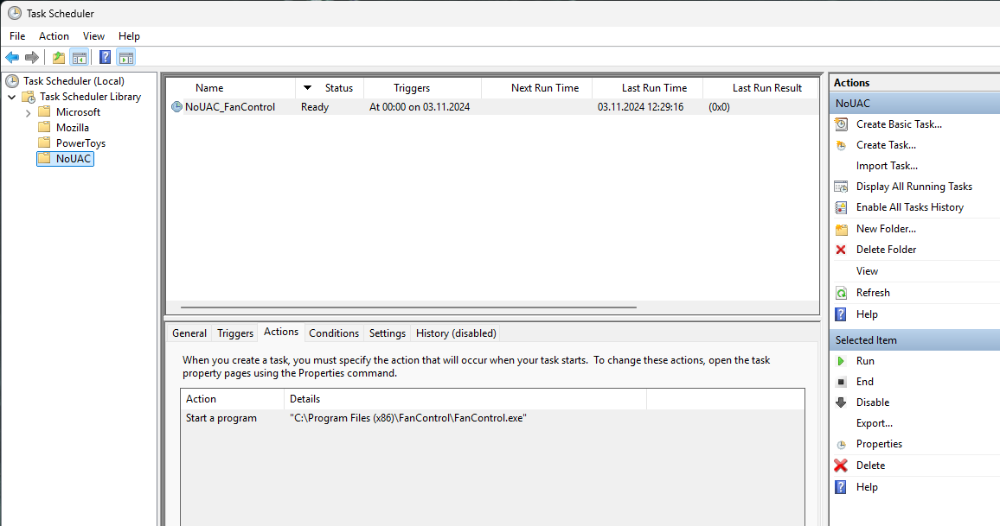

# Bypass UAC for trusted apps on Windows

Allow trusted applications on your Windows PC to bypass the UAC prompt.  

You'll need administrator access and PowerShell to run the script.

> [!NOTE]
> 
> - Only the created shortcut will bypass the UAC prompt
> - Command line arguments are not supported (yet)

## How it works

The script creates a scheduled task that runs the application with elevated privileges. A desktop shortcut is created that runs this task, which in turn runs the application.

All tasks are created in the `NoUAC` folder in the `Task Scheduler`.



## Usage

- Download [uacskip.bat](./uacskip.bat) to somewhere on your PC.  
- Drag and drop any trusted application onto the script to let it create a desktop shortcut that bypasses the UAC prompt.

### Example output on success

```shell
Creating UAC bypass for FanControl ("C:\Program Files (x86)\FanControl\FanControl.exe")

WARNING: Task may not run because /ST is earlier than current time.
SUCCESS: The scheduled task "NoUAC\NoUAC_FanControl" has successfully been created.
Shortcut created: C:\Users\mriot\Desktop\FanControl.lnk
Press any key to continue . . .
```

> [!NOTE]
> Ignore the warning about the task not running because the start time is earlier than the current time. This is intentional because we only want to run the task manually and not on a schedule.

## (Optional) Context menu option

This will allow you to right-click any `.exe` file, and select "Skip UAC" to create a shortcut that bypasses the UAC prompt.

Copy the code below into a `.reg` file, **adjust the path to the script** and run it to add a context menu entry for `.exe` files. 

```ini
Windows Registry Editor Version 5.00

[HKEY_CLASSES_ROOT\exefile\shell\Skip UAC]
"icon"="C:\\Windows\\system32\\imageres.dll,101"

[HKEY_CLASSES_ROOT\exefile\shell\Skip UAC\command]
@="\"C:\\PATH\\TO\\SCRIPT\\uacskip.bat\" %1"
```

---

> [!WARNING]
> Only use this script for trusted applications that you know are safe.  
> Running untrusted applications with elevated privileges may be dangerous.
